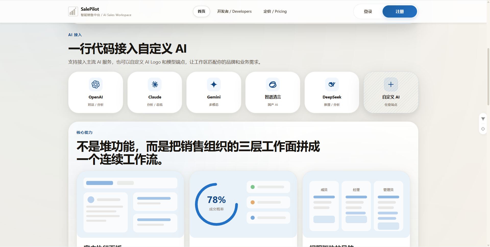
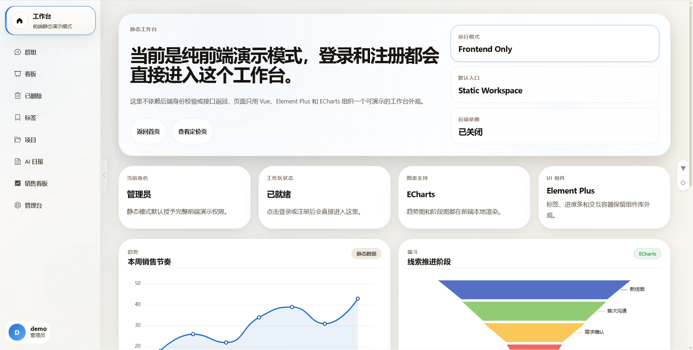
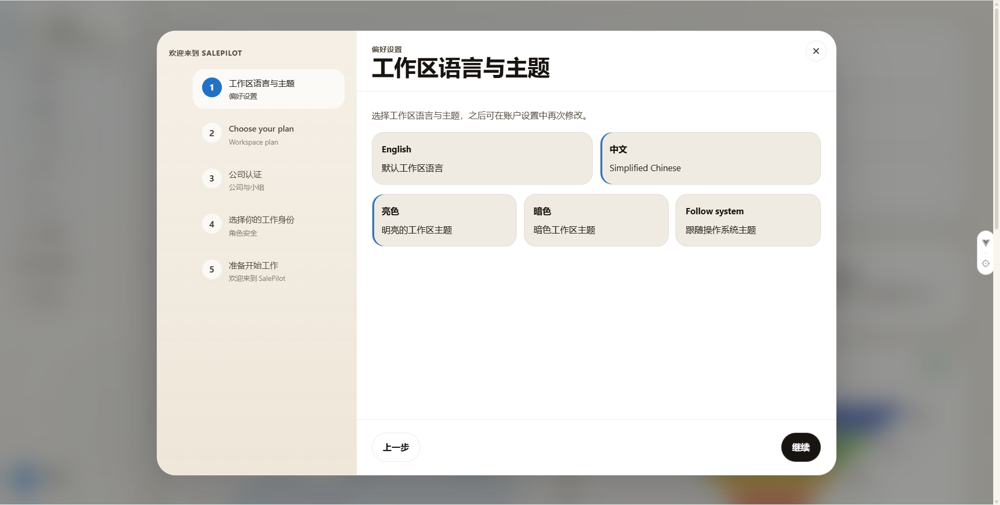
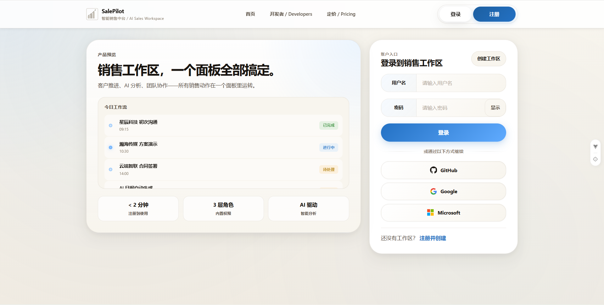
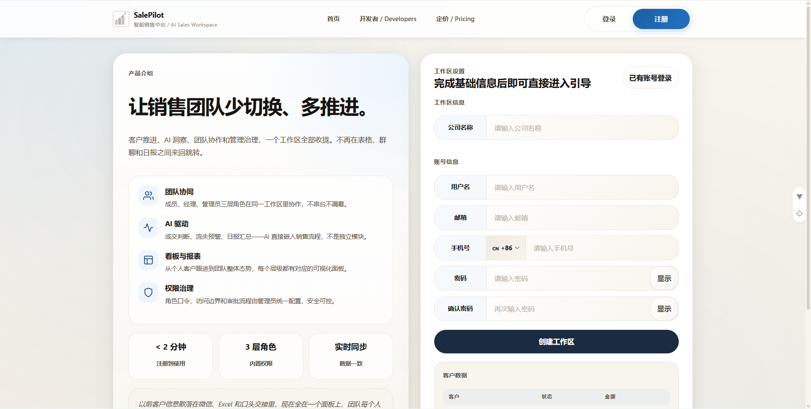
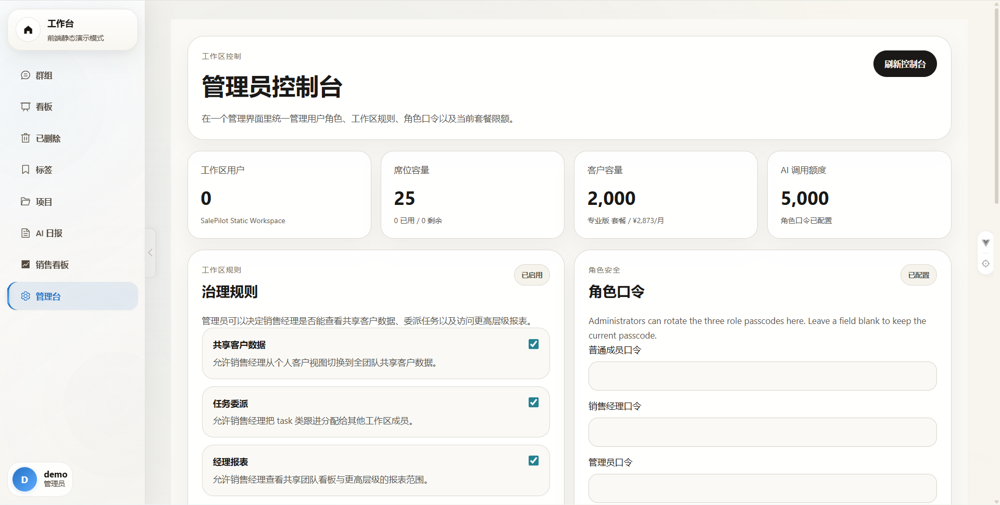
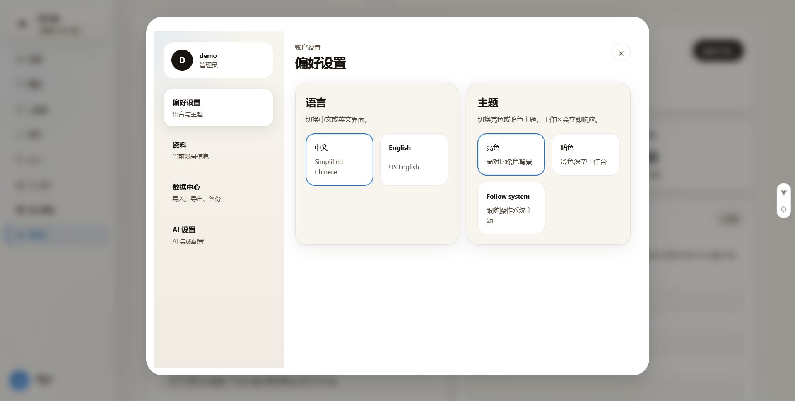
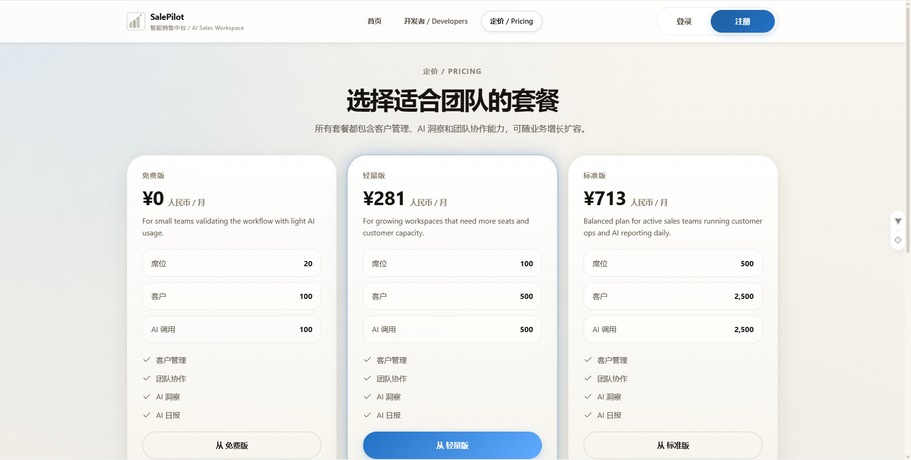
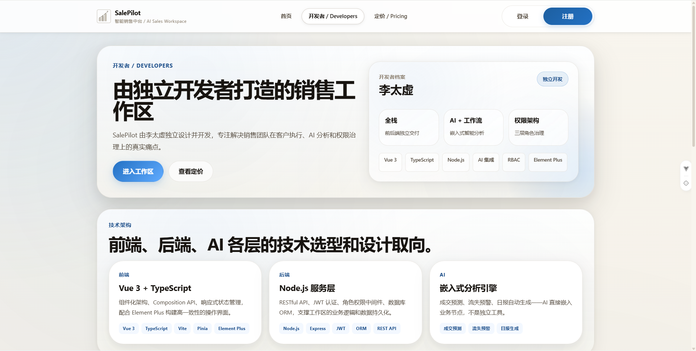
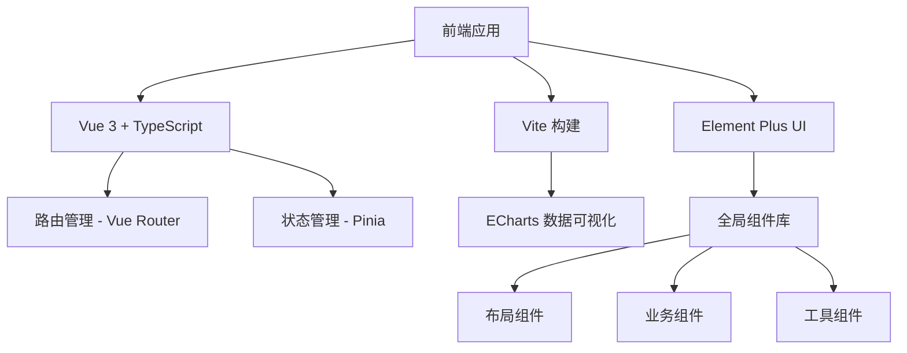

<div align="center">
  <h1>
    
    SalePilot
  </h1>

  <p>
    <strong>纯前端静态页面项目 · Vue 3 + TypeScript 构建的销售工作台应用</strong>
  </p>

  <p>
    <strong>统一销售工作区 · 统一客户执行、AI 分析、团队协作和角色治理</strong>
  </p>

  <p>
    <a href="#快速开始">快速开始</a> •
    <a href="#特性">特性</a> •
    <a href="#技术栈">技术栈</a> •
    <a href="#项目结构">项目结构</a> •
    <a href="#开发指南">开发指南</a>
  </p>

  <div>
    
    
    
  </div>
</div>

---

## 📖 项目简介

**纯前端静态页面项目** - SalePilot 是一个基于 Vue 3 + TypeScript 构建的纯前端销售工作台应用，将客户管理、AI 分析、团队协作和权限治理收拢到同一个界面。应用提供流畅的用户体验和强大的数据可视化能力，无需后端服务器即可运行和展示。

**预览GitHub静态托管**：https://tsgqjxhn.github.io/salepilot/#/home

### 🎯 核心价值

- **客户执行优先**：不是传统的表格式 CRM，而是面向执行节奏的工作面
- **AI 嵌入流程**：AI 直接嵌入在成交判断、流失预警和日报生成等关键节点
- **权限驱动导航**：成员、经理、管理员看到的是不同产品层

### 🖼️ 应用界面展示

#### 首页界面



*应用首页 - 展示产品核心功能和价值主张*

#### 工作台



*销售工作台 - 统一管理客户、报表和通知*

#### 注册欢迎组件



*欢迎轮播图，填写基本信息*

#### 用户认证



*安全登录系统*

#### 用户注册



*用户注册流程*

#### 管理功能



*管理员控制台*



*个人账户管理*

#### 其他页面-套餐



*产品定价方案*

#### 其他界面-开发者



*开发者文档和资源*

### 🏗️ 应用架构



---

## 🚀 快速开始

> **注意**: 这是一个纯前端静态页面项目，无需后端服务器即可运行。所有数据存储在浏览器本地，演示功能使用模拟数据。

### 环境要求

- **Node.js**: >= 20.19.0 或 >= 22.12.0
- **npm**: >= 9.0.0
- **浏览器**: Chrome (推荐), Firefox, Edge 最新版

### 1. 克隆项目

```bash
git clone https://github.com/your-org/salepilot-frontend.git
cd salepilot-frontend
```

### 2. 安装依赖

```bash
npm install
```

### 3. 环境配置

项目支持多种环境配置文件，请根据需要选择并配置：

#### 开发环境配置

复制 `.env.development.example` 为 `.env.development`：

```env
# 应用基础配置
VITE_APP_BASE=/
VITE_SITE_URL=http://localhost:5173

# 开发服务器
VITE_DEV_SERVER_HOST=127.0.0.1
VITE_DEV_SERVER_PORT=5173

# API 代理（对接后端服务）
VITE_API_BASE_URL=/api
VITE_DEV_PROXY_TARGET=http://localhost:5000

# 预览服务器
VITE_PREVIEW_HOST=127.0.0.1
VITE_PREVIEW_PORT=4173

# 构建配置
VITE_BUILD_TARGET=es2020
VITE_BUILD_OUT_DIR=dist
VITE_BUILD_ASSETS_DIR=assets
VITE_BUILD_SOURCEMAP=true  # 开发环境开启 source map
VITE_BUILD_MANIFEST=false
VITE_BUILD_CSS_CODE_SPLIT=true
VITE_BUILD_REPORT_COMPRESSED_SIZE=true
VITE_BUILD_MINIFY=esbuild
VITE_CHUNK_SIZE_WARNING_LIMIT=1200

# 代码优化
VITE_DROP_CONSOLE=false  # 开发环境保留 console
VITE_DROP_DEBUGGER=false # 开发环境保留 debugger
VITE_ENABLE_DEVTOOLS=true

# 第三方服务集成
VITE_GITHUB_CLIENT_ID=  # GitHub OAuth 客户端 ID
```

#### 生产环境配置

复制 `.env.production.example` 为 `.env.production`：

```env
# 应用基础配置
VITE_APP_BASE=/
VITE_SITE_URL=https://your-domain.com

# 构建配置
VITE_BUILD_TARGET=es2020
VITE_BUILD_OUT_DIR=dist
VITE_BUILD_ASSETS_DIR=assets
VITE_BUILD_SOURCEMAP=false  # 生产环境关闭 source map
VITE_BUILD_MANIFEST=false
VITE_BUILD_CSS_CODE_SPLIT=true
VITE_BUILD_REPORT_COMPRESSED_SIZE=true
VITE_BUILD_MINIFY=esbuild
VITE_CHUNK_SIZE_WARNING_LIMIT=1200

# 代码优化
VITE_DROP_CONSOLE=false  # 生产环境可选：true 表示移除所有 console
VITE_DROP_DEBUGGER=true  # 生产环境移除 debugger
VITE_ENABLE_DEVTOOLS=false
```

#### 本地开发配置

创建 `.env.local` 文件（优先级最高）：

```env
# 覆盖默认的配置值
# 例如：
# VITE_DEV_SERVER_PORT=3000
# VITE_API_BASE_URL=http://api.test.com
```

#### 环境变量说明

| 变量名 | 默认值 | 说明 |
|--------|--------|------|
| `VITE_APP_BASE` | `/` | 应用基础路径 |
| `VITE_SITE_URL` | - | 站点 URL，用于生成绝对路径 |
| `VITE_API_BASE_URL` | `/api` | API 请求基础路径 |
| `VITE_DEV_PROXY_TARGET` | `http://localhost:5000` | API 代理目标地址 |
| `VITE_ENABLE_DEVTOOLS` | `true` | 是否启用 Vue DevTools |
| `VITE_BUILD_MINIFY` | `esbuild` | 代码压缩方式：`false`/`terser`/`esbuild` |

### 4. 启动开发服务器

```bash
npm run dev
```

访问 [http://localhost:5173](http://localhost:5173) 查看应用。

### 5. 构建生产版本

```bash
npm run build
```

构建产物位于 `dist` 目录。

---

## ✨ 主要特性

### 🎨 现代化 UI 设计

- **组件库**: Element Plus - 企业级 UI 组件库
- **设计系统**: 自定义设计令牌，确保视觉一致性
- **响应式布局**: 完美适配桌面端和移动端
- **暗色模式**: 支持主题切换（预留）

### 📊 数据可视化

- **图表库**: ECharts 5 - 强大的数据可视化
- **内置图表**:
  - 销售收入趋势图
  - 客户来源饼图
  - 销售转化漏斗图
  - AI 分析仪表盘

#### 📊 数据可视化示例


*ECharts 驱动的动态数据展示*

### 🤖 AI 集成

支持多种 AI 服务提供商：

| AI 服务 | 功能 | 集成方式 |
|--------|------|----------|
| OpenAI | 对话 / 分析 | 一行代码接入 |
| Claude | 分析 / 总结 | 自定义端点 |
| Gemini | 多模态 | 可扩展 |
| 智谱清言 | 国产 AI | 本地化支持 |
| DeepSeek | 推理 / 分析 | 企业级 |

```typescript
// 示例：接入 OpenAI
import { OpenAI } from 'openai';

const openai = new OpenAI({
  apiKey: import.meta.env.VITE_OPENAI_API_KEY,
  baseURL: import.meta.env.VITE_OPENAI_BASE_URL
});
```

### 🔐 权限系统

三级角色架构，确保数据安全和权限隔离：

| 角色 | 权限范围 | 可见功能 |
|------|----------|----------|
| **成员** | 客户数据、跟进任务 | 客户列表、详情、AI 分析 |
| **经理** | 团队数据、报表 | 客户管理、团队仪表盘 |
| **管理员** | 全局配置、用户管理 | 系统设置、用户管理 |

---

## 📁 项目结构

```
src/
├── assets/                 # 静态资源
│   ├── logo.svg
│   └── ...
├── components/             # 组件库
│   ├── layout/            # 布局组件
│   │   ├── AppLayout.vue   # 主布局
│   │   ├── Header.vue      # 顶部导航
│   │   ├── Sidebar.vue     # 侧边栏
│   │   └── ...
│   ├── charts/             # 图表组件
│   │   ├── EChartCanvas.vue
│   │   ├── SalesRevenueTrendChart.vue
│   │   └── ...
│   ├── customer/          # 客户相关组件
│   │   ├── CustomerList.vue
│   │   ├── CustomerDetail.vue
│   │   ├── AiScoreRing.vue
│   │   └── ...
│   ├── report/            # 报表组件
│   │   ├── SalesDashboard.vue
│   │   ├── DailyReport.vue
│   │   └── ...
│   ├── notification/       # 通知组件
│   ├── user/              # 用户相关组件
│   └── icons/             # 图标组件
├── composables/           # 组合式函数
│   ├── useLocalizedText.ts # 国际化文本
│   └── ...
├── static page/           # 静态页面
│   ├── views/             # 页面组件
│   │   ├── Home.vue       # 首页
│   │   ├── Login.vue      # 登录页
│   │   ├── CustomerList.vue
│   │   ├── SalesDashboard.vue
│   │   └── ...
│   └── ...
├── App.vue                # 根组件
├── main.ts                # 入口文件
└── styles/                # 全局样式
    └── index.css
```

### 关键目录说明

- **components/layout**: 应用布局相关组件，包含导航、侧边栏等
- **components/charts**: 基于 ECharts 的可视化组件
- **static page/views**: 业务页面，采用文件路由约定
- **composables**: 可复用的组合式函数，实现逻辑复用

---

## 🛠️ 开发指南

### 1. 开发命令

```bash
# 启动开发服务器
npm run dev

# 构建生产版本
npm run build

# 类型检查
npm run type-check

# 预览构建结果
npm run preview

# 运行端到端测试
npm run test:e2e

# 安装 Playwright 浏览器
npm run test:e2e:install
```

### 2. 代码规范

项目集成了 ESLint + Prettier，确保代码风格一致：

```bash
# 检查代码规范
npm run lint

# 自动修复格式问题
npm run lint:fix
```

### 3. 组件开发规范

#### 命名约定

- 组件文件使用 PascalCase：`CustomerList.vue`
- 组件名使用 PascalCase：`CustomerList`
- Props 使用 camelCase：`customerData`

#### 组件结构

```vue
<template>
  <div class="customer-list">
    <!-- 模板内容 -->
  </div>
</template>

<script setup lang="ts">
import { ref, computed } from 'vue';
import type { Customer } from '@/types';

// Props 定义
defineProps<{
  customers: Customer[];
  loading?: boolean;
}>();

// Emits 定义
const emit = defineEmits<{
  select: [customer: Customer];
  delete: [id: string];
}>();

// 组件逻辑
const selectedCustomer = ref<Customer | null>(null);

// 计算属性
const filteredCustomers = computed(() => {
  return customers.value.filter(c => c.active);
});
</script>

<style scoped>
.customer-list {
  /* 组件样式 */
}
</style>
```

### 4. 状态管理

使用 Pinia 进行状态管理：

```typescript
// stores/customer.ts
import { defineStore } from 'pinia';
import type { Customer } from '@/types';

export const useCustomerStore = defineStore('customer', {
  state: () => ({
    customers: [] as Customer[],
    loading: false,
  }),
  
  actions: {
    async fetchCustomers() {
      this.loading = true;
      const response = await api.get('/customers');
      this.customers = response.data;
      this.loading = false;
    },
  },
});
```

### 5. 路由配置

路由采用文件系统自动生成：

```typescript
// 路由示例：
// src/static page/views/customer/CustomerList.vue -> /customer/list
// src/static page/views/report/SalesDashboard.vue -> /report/dashboard
```

---

## 🎨 样式系统

### CSS 变量系统

项目使用 CSS 变量定义设计令牌：

```css
:root {
  /* 颜色系统 */
  --accent-primary: #2371c4;
  --accent-secondary: #60abff;
  --success: #2ea043;
  --warning: #e6a23c;
  --danger: #f56c6c;
  
  /* 间距系统 */
  --spacing-xs: 4px;
  --spacing-sm: 8px;
  --spacing-md: 16px;
  --spacing-lg: 24px;
  --spacing-xl: 32px;
  
  /* 阴影系统 */
  --shadow-sm: 0 2px 4px rgba(0,0,0,0.1);
  --shadow-md: 0 4px 8px rgba(0,0,0,0.1);
  --shadow-lg: 0 8px 16px rgba(0,0,0,0.1);
}
```

### 样式组织

- 全局样式：`src/styles/index.css`
- 组件样式：使用 `<style scoped>`
- 工具类：在全局样式中定义常用工具类

---

## 🔄 API 集成

> **注意**: 作为纯前端静态项目，API 调用主要用于演示目的。实际部署时，需要配置真实后端服务。

### 环境配置要求

API 集成需要配置以下环境变量：

```env
# API 基础路径
VITE_API_BASE_URL=/api  # 开发环境使用代理
# 或
VITE_API_BASE_URL=https://api.your-domain.com  # 生产环境真实地址

# 开发环境代理配置
VITE_DEV_PROXY_TARGET=http://localhost:5000  # 后端服务地址
```

### API 配置

```typescript
// src/api/index.ts
import axios from 'axios';

const api = axios.create({
  baseURL: import.meta.env.VITE_API_BASE_URL || '/api', // 默认使用相对路径
  timeout: 10000,
});

// 请求拦截器
api.interceptors.request.use(config => {
  const token = localStorage.getItem('token');
  if (token) {
    config.headers.Authorization = `Bearer ${token}`;
  }
  return config;
});

export default api;
```

### API 调用示例

```typescript
// 客户 API
export const customerApi = {
  getList: () => api.get('/customers'),
  getDetail: (id: string) => api.get(`/customers/${id}`),
  create: (data: Partial<Customer>) => api.post('/customers', data),
  update: (id: string, data: Partial<Customer>) => api.put(`/customers/${id}`, data),
  delete: (id: string) => api.delete(`/customers/${id}`),
};
```

---

## 📦 依赖管理

### 核心依赖

| 依赖 | 版本 | 用途 |
|------|------|------|
| vue | ^3.5.30 | 框架核心 |
| vue-router | ^5.0.4 | 路由管理 |
| pinia | ^3.0.4 | 状态管理 |
| element-plus | ^2.13.6 | UI 组件库 |
| echarts | ^5.6.0 | 数据可视化 |
| axios | ^1.14.0 | HTTP 客户端 |
| typescript | ~5.9.3 | 类型支持 |
| vite | ^7.3.1 | 构建工具 |

### 开发依赖

| 依赖 | 版本 | 用途 |
|------|------|------|
| @vitejs/plugin-vue | ^6.0.4 | Vue 插件 |
| vue-tsc | ^3.2.5 | TypeScript 检查 |
| eslint | ^10.1.0 | 代码检查 |
| prettier | ^3.8.1 | 代码格式化 |
| @playwright/test | ^1.59.1 | E2E 测试 |

---

## ⚙️ 环境配置总结

### 环境文件说明

| 文件 | 用途 | 优先级 |
|------|------|--------|
| `.env` | 默认环境变量 | 最低 |
| `.env.local` | 本地覆盖文件（不提交到 Git） | 高 |
| `.env.development` | 开发环境变量 | 中 |
| `.env.production` | 生产环境变量 | 中 |
| `.env.*.example` | 模板文件，供参考 | - |

### 必需配置

#### 开发环境
- 无需配置，使用默认值即可运行演示

#### 生产部署
- **必须配置**: `VITE_SITE_URL` - 设置您的域名
- **可选**: `VITE_API_BASE_URL` - 如果需要真实 API

### 第三方服务集成

项目支持集成以下服务，需在环境变量中配置：

```env
# GitHub OAuth
VITE_GITHUB_CLIENT_ID=your_github_client_id

# OpenAI（可选）
VITE_OPENAI_API_KEY=your_openai_key
VITE_OPENAI_BASE_URL=https://api.openai.com/v1  # 或自定义代理

# 其他 AI 服务
# VITE_CLAUDE_API_KEY=
# VITE_GEMINI_API_KEY=
```

---

## 🚀 部署

### 静态部署

作为纯前端静态项目，构建后的文件可以直接部署到任何静态托管服务，无需服务器：

```bash
# 构建项目
npm run build

# dist 目录包含所有静态资源
# 可以直接部署到：
# - Vercel
# - Netlify
# - GitHub Pages
# - 任何静态托管服务
# - Nginx/Apache 静态文件服务器
```

### Nginx 配置示例

```nginx
server {
    listen 80;
    server_name your-domain.com;
    root /var/www/salepilot;
    index index.html;

    # 处理 SPA 路由
    location / {
        try_files $uri $uri/ /index.html;
    }

    # 静态资源缓存
    location /assets/ {
        expires 1y;
        add_header Cache-Control "public, immutable";
    }

    # API 代理
    location /api/ {
        proxy_pass http://localhost:5000;
        proxy_set_header Host $host;
        proxy_set_header X-Real-IP $remote_addr;
    }
}
```

---

## 🤝 贡献指南

我们欢迎所有形式的贡献！

### 开发流程

1. Fork 项目
2. 创建特性分支：`git checkout -b feature/new-feature`
3. 提交更改：`git commit -m 'Add new feature'`
4. 推送分支：`git push origin feature/new-feature`
5. 创建 Pull Request

### 提交规范

使用 Conventional Commits 格式：

```
feat: 添加新功能
fix: 修复 bug
docs: 更新文档
style: 代码格式化
refactor: 重构
test: 添加测试
chore: 构建过程或辅助工具的变动
```

---

## 📄 许可证

[MIT License](LICENSE) © 2024 SalePilot Team

---

## 🙏 致谢

- [Vue.js](https://vuejs.org/) - 渐进式 JavaScript 框架
- [Element Plus](https://element-plus.org/) - Vue 3 UI 组件库
- [ECharts](https://echarts.apache.org/) - 数据可视化图表库
- [Vite](https://vitejs.dev/) - 下一代前端构建工具

---

---

## 🎨 更多界面展示


*首页完整视图 - 包含产品介绍和功能导航*


*开发者中心 - API 文档和使用指南*

<div align="center">
  <p>Made with ❤️ by SalePilot Team</p>
  <p>
    <a href="https://github.com/your-org/salepilot-frontend/issues">报告问题</a> •
    <a href="https://github.com/your-org/salepilot-frontend/discussions">讨论</a> •
    <a href="#">文档</a>
  </p>
</div>
